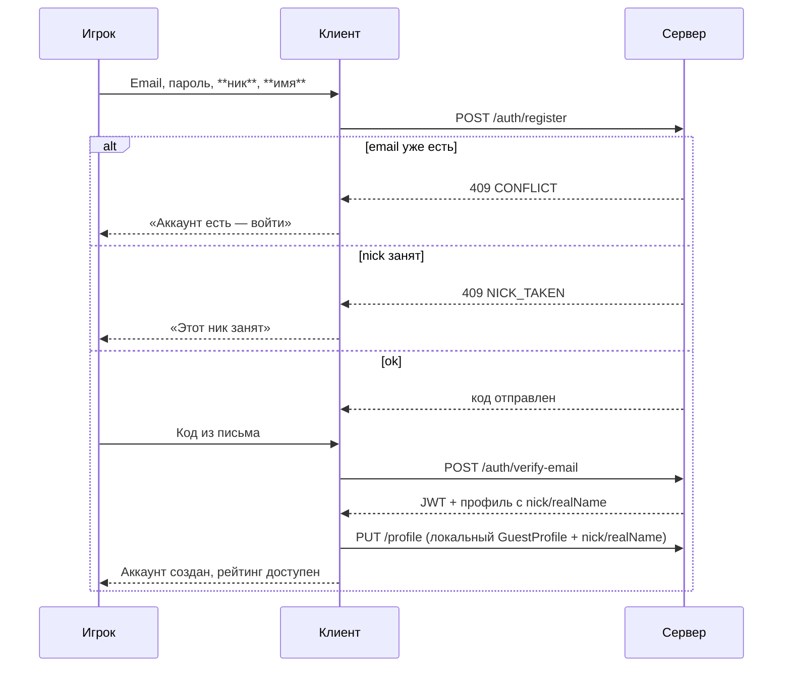
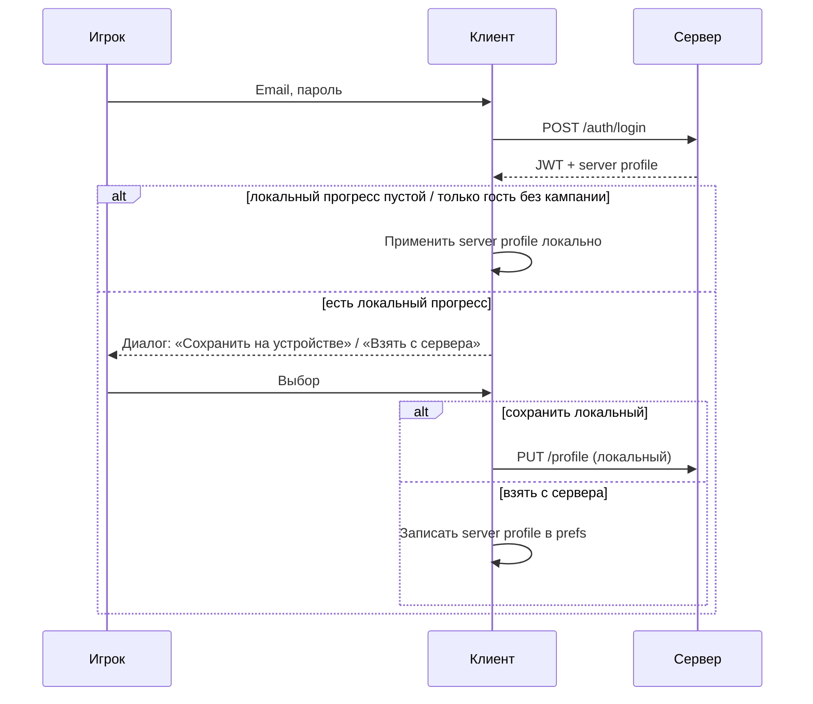

# Аккаунт, авторизация, рейтинг — спецификация

> **Статус:** утверждено пользователем (2026-07-11).  
> **Пункт roadmap:** 1 ([`ROADMAP.md`](ROADMAP.md)).  
> **Контракт REST:** [`expansion_server/API_DOCS.md`](../expansion_server/API_DOCS.md) — обновляется при реализации.

---

## Решения (зафиксировано)

| # | Тема | Решение |
|---|------|---------|
| 1 | Способ входа | Email + пароль (без телефона) |
| 2 | Верификация email | **Сразу** — код на почту до создания аккаунта |
| 3 | Забыл пароль | Reset по email, **SMTP как в Joy Pick** (`nodemailer`, env `SMTP_*`) |
| 4 | Гость → регистрация | Переносим **весь** локальный прогресс |
| 5 | Email уже занят | Предлагаем **войти**; после входа — выбор прогресса (см. ниже) |
| 6 | Данные на сервере | **Всё**, что сейчас в `GuestProfile` / prefs |
| 7 | Удаление аккаунта | Обязательно (`DELETE /api/account`) |
| 8 | Имя и ник | При регистрации: **имя** (не уникально) + **ник** (уникальный, проверка на сервере) |
| 9 | Рейтинг — подпись | **`Ник (имя)`** — например `StarLord (Иван)` |
| 10 | БД | **MariaDB** (MySQL-совместимая) — нативно на Beget, как legacy |
| 11 | Прод | API на **redmobi VPS** `46.173.25.193`; сайт-заглушка — **danilagames.ru** (Beget) |
| — | Рейтинг | Только **зарегистрированные**; топ **50** по `scoreClassic` |
| — | Пуши | **Не в этом этапе** |

---

## Потоки (клиент)

### Регистрация (новый email)



### Вход (email уже в БД)



### Забыл пароль

1. Email → `POST /auth/forgot-password` → код/ссылка на почту  
2. Код + новый пароль → `POST /auth/reset-password`

(Тот же SMTP-стек, что верификация.)

---

## Имя и ник

| Поле | API / БД | Уникальность | Где показываем |
|------|----------|--------------|----------------|
| **Ник** | `nick` | **Да** (case-insensitive) | Рейтинг, основная подпись |
| **Имя** | `realName` | Нет | Профиль, в рейтинге в скобках |

**Формат в рейтинге:** `{nick} ({realName})` — пример: `StarLord (Иван)`.

### Правила ника (MVP)

- Длина: **3–20** символов
- Символы: буквы (латиница / кириллица), цифры, `_`
- Без пробелов; trim при сохранении
- В БД: `nick_normalized` (lowercase) для unique index
- Зарезервированные: `admin`, `guest`, `expansion`, … (список на сервере)

### Проверка занятости

| Метод | Путь | Назначение |
|-------|------|------------|
| GET | `/api/auth/nick-available?nick=...` | `true` / `false` (debounce на клиенте при вводе) |

При `POST /auth/register` и `POST /auth/verify-email` — повторная проверка (race-safe unique constraint).

### Гость → регистрация

- Поле **имя** можно предзаполнить из локального `displayName` (если игрок уже вводил в профиле)
- **Ник** — только при регистрации (обязателен)

### Редактирование после регистрации

- **Имя** — можно менять в профиле (`PUT /profile`)
- **Ник** — **v1: не меняется** (упрощает рейтинг и уникальность); смена ника — отдельная задача позже

---

## Данные профиля (сервер = зеркало локалки + аккаунт)

Колонки в `users`: `nick`, `nick_normalized`, `real_name`.

JSON в `user_profiles.profile_json`:

| Поле | Тип | Примечание |
|------|-----|------------|
| `mapClassic` | int | Текущая миссия |
| `scoreClassic` | int | Очки (рейтинг) |
| `difficulty` | string | `easy` / `average` / `difficult` |
| `univerKind` | string | `classic` / … |
| `firstBattleCompleted` | bool | |
| `displayName` | string | **Deprecated → `realName`**; синх с `users.real_name` для гостевого кода |
| `defeatStreakSceneId` | int | |
| `defeatStreakCount` | int | |
| `asteroidTutorialSeen` | bool | |
| `debrisTutorialSeen` | bool | |
| `mission1TutorialCompleted` | bool | |
| `mapTutorialSeen` | bool | |
| `seenFeatureIntros` | string[] | |
| `campaignStartedAtMillis` | int | |
| `meta` | object | `PlayerMetaProgress` (слоты, `enemyPowerLevel`) |

Синхронизация: после побед/апгрейдов/смены имени — `PUT /profile` (debounce на клиенте).

---

## API (черновик для реализации)

### Auth

| Метод | Путь | Назначение |
|-------|------|------------|
| POST | `/api/auth/register` | email, password, **nick**, **realName** → код (аккаунт **не** создан) |
| GET | `/api/auth/nick-available` | Проверка свободного ника |
| POST | `/api/auth/verify-email` | code + email + password + nick + realName → user + JWT |
| POST | `/api/auth/login` | Email + password → JWT (только `email_verified`) |
| POST | `/api/auth/forgot-password` | Email → код reset |
| POST | `/api/auth/reset-password` | Email + код + new password |
| POST | `/api/auth/refresh` | Refresh token → новый access |
| GET | `/api/auth/me` | id, email, nick, realName, emailVerified |
| DELETE | `/api/account` | Удаление аккаунта и профиля (Bearer) |

### Profile

| Метод | Путь | Назначение |
|-------|------|------------|
| GET | `/api/profile` | Полный профиль (Bearer) |
| PUT | `/api/profile` | Замена/обновление профиля |

### Рейтинг (публичный)

| Метод | Путь | Назначение |
|-------|------|------------|
| GET | `/api/leaderboard?limit=50` | rank, **label** (`nick (realName)`), scoreClassic, mapClassic |

Только пользователи с `email_verified = true`. Гости в таблице **не** участвуют.

---

## БД — MariaDB

**Почему MariaDB:** нативная поддержка на **Beget VPS**, совместимость с legacy Expansion (MySQL), простой деплой без отдельного PostgreSQL.

| Таблица | Назначение |
|---------|------------|
| `users` | id, email (unique), **nick**, **nick_normalized** (unique), **real_name**, password_hash, email_verified, created_at |
| `user_profiles` | user_id (FK), profile_json, updated_at |
| `email_verification_codes` | email, code_hash, password_hash_pending, **nick**, **real_name**, expires_at |
| `password_reset_codes` | email, code_hash, expires_at |
| `refresh_tokens` | token_hash, user_id, expires_at |

Пароли: **bcrypt** (не SHA256 как в MVP in-memory).

---

## Деплой (Beget VPS)

| Среда | API |
|-------|-----|
| Dev | `http://127.0.0.1:3000/api` |
| Prod | **Beget VPS** — URL уточним при настройке (поддомен / reverse proxy) |

Клиент: `--dart-define=API_BASE_URL=...` → `ApiConfig`.

На сервере Beget:

- Node.js процесс (pm2 / systemd)
- MariaDB (локально или managed на Beget)
- `.env` — JWT, DB, SMTP (не в git)
- HTTPS — через панель Beget / nginx

Детали деплоя — отдельный чеклист при подключении VPS (не блокирует разработку локально).

---

## Email (как Joy Pick)

Переменные в `expansion_server/.env` (см. `.env.example`):

```env
SMTP_HOST=smtp.gmail.com
SMTP_PORT=587
SMTP_SECURE=false
SMTP_USER=
SMTP_PASS=
EMAIL_FROM=noreply@expansion.example
```

Модуль: `nodemailer`, паттерн из `joy_pick/server/api/config/email.js`.

Письма:

- **Верификация** — 6-значный код, TTL ~15 мин  
- **Сброс пароля** — 6-значный код или одноразовая ссылка, TTL ~15 мин  

Тексты RU/EN — с клиента (l10n) или дефолт на сервере.

---

## UI клиента (`expansion_app`)

### Новые маршруты

| Путь | Экран |
|------|--------|
| `/auth/register` | Email, пароль, **ник**, **имя**, код верификации |
| `/auth/login` | Вход |
| `/auth/forgot` | Забыл пароль |
| `/leaderboard` | Таблица топ-50 |

### Профиль (`/profile`)

- Для **гостя:** блок «Зарегистрироваться» + текст **зачем** (облако, рейтинг, не потерять прогресс) → `/auth/register`
- Для **аккаунта:** email, «Выйти», «Удалить аккаунт» (подтверждение)

### Прогресс (`/progress`)

- Кнопка внизу: **«Лучшие результаты»** → `/leaderboard`

### Рейтинг (`/leaderboard`)

- Таблица: место, **`Ник (имя)`**, очки, (опционально миссия)
- **Гость:** список сверху + внизу **нескроллируемая** плашка: «Можешь быть в таблице — зарегистрируйся» + кнопка → `/auth/register`

### Диалог выбора прогресса

После login, если локальный `hasCampaignProgress` и server profile тоже не пустой:

- Карточка **«На устройстве»**: миссия, очки  
- Карточка **«На сервере»**: миссия, очки  
- Кнопки выбора (без автоматического merge)

---

## Порядок реализации (подэтапы)

| Шаг | Пакет | Содержание |
|-----|--------|------------|
| **1a** | `expansion_server` | БД, миграции, bcrypt, SMTP, auth routes |
| **1b** | `expansion_server` | Profile CRUD, delete account, leaderboard |
| **1c** | `expansion_server` | `API_DOCS.md`, `.env.example`, load-check |
| **2a** | `expansion_app` | Domain/data: AuthRepository, SecureStorage, Dio |
| **2b** | `expansion_app` | Экраны auth + диалог прогресса |
| **2c** | `expansion_app` | Профиль, прогресс, leaderboard, l10n |
| **2d** | `expansion_app` | Автосинк профиля после игры |

**Не трогаем:** кампания м6+, арты, админка, пуши, OAuth.

---

## Связанные файлы

| Путь | Роль |
|------|------|
| `expansion_app/lib/domain/entities/guest_profile.dart` | Канон полей профиля |
| `expansion_app/lib/data/repositories/guest_profile_repository_impl.dart` | Локальное хранилище |
| `joy_pick/server/api/config/email.js` | Референс SMTP |
| `expansion_app/lib/presentation/pages/profile_page.dart` | Точка входа «Зарегистрироваться» |
