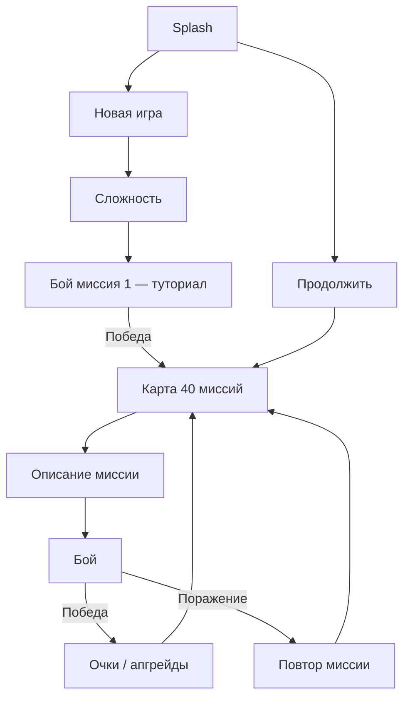
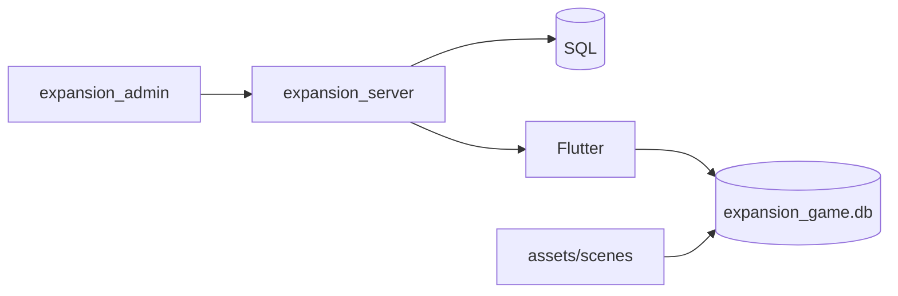

# Концепция игры Expansion

> **Статус:** **1.0 — утверждено по механикам и продукту** (2026-05-25).  
> Сюжетные тексты миссий — **черновик §15** (редактируем по ходу контента).  
> После этого документа — domain, SQLite, сиды, экраны (фаза 2+).

Связанные документы: [`game-plan.md`](game-plan.md), [`project-specs.md`](project-specs.md).

---

## 1. В одном абзаце

**Expansion** — портретная космическая RTS в духе *Eufloria*: захват баз, отправка флотов по прямым линиям, рост и улучшения на узлах. Кампания **Classic** — **40 миссий** на карте-кампании; каждый бой — поле с сеткой (MVP **5×8**, см. §5.6). Между боями — **очки** и **постоянные апгрейды игрока**; внутри боя — **локальные** улучшения баз за ресурсы. Сложность задаёт темп AI. Гость играет без регистрации; прогресс в prefs, на сервере — после входа. Контент с админки → API → кэш SQLite на устройстве.

---

## 2. Жанр и ощущение

| Аспект | Решение |
|--------|---------|
| Референс | *Eufloria* — захват узлов, поток юнитов, давление AI, «мягкая» космическая фантазия |
| Отличие от Eufloria | У нас **прямоугольная сетка** и **мета-прогресс** (апгрейды между миссиями), не граф орбит |
| Камера | 2D, портрет; на больших полях — **панорамирование** (фаза после MVP, §5.6) |
| Темп | Real-time, game loop в isolate (~50 FPS) |
| Сессия | Бой 3–8 мин + карта кампании |
| Платформа | iOS / Android |

---

## 3. Утверждённые продуктовые решения

| # | Тема | Решение |
|---|------|---------|
| 1 | Миссии v1 | **40** (есть `objects_1…40`); 101 — расширение контентом позже |
| 2 | Режимы | Играем **Classic**; `Univer` / random / tower — **enum на будущее**, без UI в v1 |
| 3 | Первый бой | **«Новая игра» → сразу бой** (обучение, вовлечение). После **первой победы** — хаб **карта**, оттуда миссии |
| 4 | Поражение | См. §7.3 (два слоя апгрейдов) |
| 5 | Апгрейды игрока | Привязаны к профилю: **prefs** (гость) → **бэкенд** (аккаунт) |
| 6 | Сюжет | **Новый**, не копируем legacy JSON; каркас §15 |
| 7 | Гость | Можно играть **без регистрации** всегда; при удалении app **прогресс гостя теряется** |
| 8 | Донат | **Оставляем**, UI/копирайт «причесать» позже |
| 9 | Баланс | **Не копируем** legacy; формулы проектируем заново, итерации после playtest |

---

## 4. Основной игровой цикл (Classic)



**Флаги прогресса (prefs / позже сервер):**

- `mapClassic` — текущая миссия (1…40).
- `firstBattleCompleted` — первая победа прошла → показываем карту как основной хаб.
- `scoreClassic`, `level`, набор **мета-апгрейдов**, `isBegin` (если нужен для одноразовых сцен).

---

## 5. Бой

### 5.1 MVP: сетка 5×8

- **5 строк × 8 столбцов** = 40 клеток — наследие legacy и готовых `objects_*.json`.
- Сущности: базы (our / enemy / neutral), отряды кораблей, астероиды.
- Отправка: прямая линия между базами, если нет блокера на линии.
- Победа: нет вражеских баз. Поражение: нет своих баз.

### 5.2 Два слоя «улучшений» (важно)

| Слой | Где | Примеры | Сохранение |
|------|-----|---------|------------|
| **Мета-апгрейды** | Меню «Улучшения», между миссиями | Скорость флота, прочность, доход, щит, стартовые корабли | **Профиль** (prefs → API) |
| **Тактические** | Внутри боя на базе за ресурсы | Ускорить постройку, усилить щит на этой базе | **Только этот бой**, сброс при новом бое |

**Поражение (утверждаем по умолчанию):**

- **Мета-апгрейды не сбрасываем** — игрок не наказывается за эксперимент на сложности.
- **Тактические** и состояние поля — естественно обнуляются при рестарте миссии.
- UI: «Повторить миссию» + при 2–3 поражениях подсказка снизить сложность (без принудительного сброса меты).

Если захочешь «режим хардкор» со сбросом меты — отдельный переключатель в «Новой игре», не в v1.

### 5.3 Очки за бой

- Идея: быстрее и чище захват → больше очков на мета-апгрейды.
- Формулы legacy **не переносим**; задаём простую понятную шкалу на playtest (§9).

### 5.4 AI

- Периодические ходы врага (зависит от сложности + мета `tic` у врага после побед игрока).
- Атака / поддержка / апгрейд баз по логике в духе legacy `EnemyIntellect`, но с новым балансом.

### 5.5 Техника

- Isolate game loop → `BattleCubit` (после MVP-среза на таймере).
- Отрисовка: сначала простые спрайты/формы; оптимизация — `RepaintBoundary`, кэш.

### 5.7 Управление чужими (AI) — отдельный модуль

Legacy: один файл `setStateEnemy`, почти без случайности → враг «как машина».

**Архитектура v1:**

```text
lib/game_core/
  battle/           # правила поля, отправка, захват, win/lose
  ai/
    battle_intent.dart      # SendFleet, UpgradeBase, …
    enemy_personality.dart  # веса, шум, «сомнение»
    enemy_commander.dart    # snapshot + RNG → список intents
```

- `BattleCubit` только **применяет** intents и тикает движок; AI **не** знает про Flutter.
- **Случайность:** сид = `sceneId + tickBucket`; взвешенный выбор цели; shuffle кандидатов; jitter интервала хода; на easy — чаще субоптимальные ходы.
- Сложность: `ticEnemy` + параметры `EnemyPersonality` из `GameDifficulty`.
- Кампания акт III («зеркало»): позже отдельный пресет personality.

### 5.6 Сетка: «мало ли 5×8?» и увеличение поля

**Ответ:** для **первых 40 миссий и обучения** — **достаточно** (короткие сессии, читаемо на телефоне). Для ощущения «как большая Eufloria» — **тесновато**.

**Увеличение поля (например 8×14, 10×16) — реалистично, средняя сложность:**

| Компонент | Что делаем |
|-----------|------------|
| Логика | `rows` / `cols` в одном конфиге; координаты в layout JSON как сейчас |
| UI | Поле больше экрана → **`InteractiveViewer`** или scroll + фиксированный размер клетки; жесты **pan** одним пальцем |
| Контент | Новые/пересобранные `objects_*.json`; старые 5×8 остаются валидными |
| Камера | Опционально лёгкий zoom (pinch) — не обязателен в v1 |

**Рекомендуемый план:**

1. **MVP / v1.0:** бой **5×8**, 40 миссий — быстрее выйти в играбельность.
2. **v1.1+:** 5–10 миссий на **увеличенной** сетке + pan; если заходит — стандарт для новых глав.

Не блокирует архитектуру: закладываем `battle_rows`, `battle_cols` в layout миссии (или глобальный default per mission).

---

## 6. Сравнение с Eufloria (честно)

| Eufloria | Expansion (наш таргет) |
|----------|-------------------------|
| Захват всех вражеских узлов | ✅ То же |
| Поток юнитов с узла на узел | ✅ Флоты по линиям |
| Рост силы на захваченном узле | ✅ Производство кораблей / ресурсы |
| Карта узлов, не прямоугольник | ❌ У нас **сетка** — проще контент и AI |
| Мало мета между уровнями в оригинале | ✅ У нас **кампания + апгрейды** — ближе к «RPG-слою» |
| Большие карты, зум | ⚠️ MVP меньше; **pan/zoom позже** (§5.6) |
| Органичный визуал | Стиль свой (космос, Kelly Slab, палитра Expansion) |

**Вывод:** для **играбельной** игры ядро верное (захват, отправка, рост, AI). Отличия осознанные: сетка + мета-прогресс + мобильный портрет. Не клон 1:1 — **дух Eufloria**, своя оболочка.

---

## 7. Карта кампании (40 миссий)

### 7.1 Контент миссии (`Scene`)

| Поле | Назначение |
|------|------------|
| `id` | 1…40 (v1) |
| `name_ru` / `name_en` | Название узла |
| `description_ru` / `description_en` | Текст на карте |
| `battle_ru` / `battle_en` | Брифинг перед боем (короткий, обучающий) |
| `type_scene` | Визуал узла (first…fifth в ряду) |
| Layout | `objects_{id}.json` или строка в БД |

Контракт API/БД: **snake_case**. Импорт legacy camelCase — одноразовый конвертер.

### 7.2 Визуал карты

- **5 колонок** × **8 рядов** = 40 узлов.
- Змейка по рядам (порядок храним в БД, не пересчитываем на клиенте каждый запуск).
- Текущая миссия подсвечена; будущие — замок; пройденные — replay (опционально v1.1).

---

## 8. Режимы и сложность

### 8.1 Сложность (v1)

| Уровень | Роль |
|---------|------|
| Easy | Обучение, медленный AI |
| Average | Дефолт |
| Difficult | Вызов |

Числа тиков AI — **новый баланс**, не копия legacy (§9).

### 8.2 Enum на будущее (без UI в v1)

```text
CampaignMode: classic | random | tower   // прогресс map_*, score_*
Univer: classic | generated | strategic // тип генерации/правил кампании
```

---

## 9. Мета: очки и апгрейды

### 9.1 Мета-апгрейды (между миссиями)

Типы (рабочий список, имена уточним в domain):

- скорость кораблей, прочность, скорость постройки, доход ресурсов, щит, стартовые корабли;
- у врага дополнительно «частота хода AI» — растёт по мере кампании, не обязательно покупается игроком.

Макс. уровень, стоимость, кривая — **проектируем с нуля**.

### 9.2 Экраны

- **`/upgrades`** — мета-апгрейды (с splash).
- Синк контента с сервером — отдельный поток (не путать с апгрейдами игрока).

### 9.3 Баланс

- Отдельная задача после **вертикального среза** (1 миссия + бой + 1 апгрейд).
- Метрики: длина боя, % поражений на easy, ощущение «слишком длинная пауза до хода AI».

---

## 10. Пользователь и данные

| Данные | Хранилище |
|--------|-----------|
| Гость, настройки, прогресс classic, мета-апгрейды | `SharedPreferences` |
| Каталог миссий, layout, версия контента | SQLite |
| Аккаунт, синк прогресса | Сервер (фаза 5) |
| Токены | Secure storage |

**Регистрация:** опциональна; без неё прогресс только локально.

---

## 11. Экраны (целевое)

| Экран | Маршрут | v1 |
|-------|---------|-----|
| Splash | `/` | ✅ |
| Настройки | `/settings` | ✅ |
| История | `/intro-story` | ✅ (обновить текст под §15) |
| Новая игра | `/begin` | обязательно |
| Карта | `/maps` | обязательно |
| Бой | `/battle` | обязательно |
| Улучшения | `/upgrades` | обязательно |
| Профиль | `/profile` | скелет → регистрация позже |
| Прогресс | `/progress` | скелет |
| Донат | `/donate` | после MVP, «причесать» |
| Справка | `/help` | желательно к бою |

---

## 12. Контент и инфраструктура



---

## 13. MVP (играбельный срез)

1. SQLite + 40 сцен + layout из сида.
2. Новая игра → бой 1 → победа → карта.
3. Бой 5×8: отправка, захват, win/lose.
4. Очки + 2–3 мета-апгрейда с экрана `/upgrades`.
5. Гость в prefs; баланс «v0» на ощущения, не на legacy.

Дальше: регистрация, донат, большие карты, миссии 41+.

---

## 14. Что из legacy не переносим

См. предыдущие версии: GetX, отключённый `init`, баги локали/`LostEvent`, секреты в apiserver, `isEdit` в проде.

---

## 15. Сюжет (новый, черновик на 40 миссий)

> Тексты для ARB / `scenes` допишем при наполнении БД. Смысл согласован: **не** копируем legacy.

**Завязка (вступление, уже близко по духу):** 2220-е, человечество расшилось по поясу Солнечной системы. Сеть форпостов — «Экспансия» — держит ресурсы. Сигнал с Плутона: неизвестные строят **зеркальную** сеть захвата узлов. Совет назначает вас координатором обороны.

**Акт I (миссии 1–10) — «Пояс»:** обучение — захват нейтралов, щиты, первый сильный AI. Плутон-граница.

**Акт II (11–25) — «Внешний пояс»:** крупные ноды, комбинированный AI, первые мета-апгрейды критичны.

**Акт III (26–35) — «Зеркало»:** враг копирует ваш стиль; миссии с особыми layout.

**Акт IV (36–40) — «Ядро»:** штурм опорного кластера у Плутона; финал — удержать все узлы под ограничением по времени (механика уточним на балансе).

**Тон:** сдержанный sci-fi, короткие брифинги (2–3 предложения), без перегруза лором в бою.

---

## 16. Модели данных — переработка (не копия legacy)

> Legacy (`UserGame`, `Scene`, `AllUpgrade`, `Base`…) — **только ориентир по полям**. На фазе 2 проектируем **новые** entity/DTO под концепцию 1.0 и стек digitalsquare.

**Принципы:**

| Правило | Смысл |
|---------|--------|
| Разделение слоёв | `domain/entities` — без JSON; `data/models` — DTO + `toEntity()` / `toJson()` вручную |
| Контент ≠ игрок | Кампания (`Scene`, layout, `battle_rows/cols`) в **SQLite**; гость и мета-апгрейды в **prefs** → API |
| Два типа апгрейдов | `MetaUpgrade` (профиль) и тактика боя (`BaseUpgrade` / состояние в `BattleState`) — **разные типы** |
| Расширяемость поля | У layout миссии: `gridRows`, `gridCols` (default 5×8); enum режимов **без** мёртвых полей random/tower в v1 UI |
| Имена и контракт | snake_case в БД/API; нормальные имена в Dart (`percent`, не `percenstValue`) |
| Без codegen | Нет freezed / json_serializable / build_runner для моделей |
| Состояние UI | Иммутабельные `State` + `Equatable` в Cubit; не тащить `BuildContext` в репозитории |

**Черновик сущностей (уточним при реализации):**

- `CampaignScene` — id, тексты, `typeScene`, порядок на карте.
- `BattleLayout` — sceneId, размер сетки, список `PlacedBase` (owner, x, y, шаблон).
- `GuestProfile` — mapClassic, scoreClassic, difficulty, metaUpgrades, `firstBattleCompleted`.
- `BattleSnapshot` — bases, ships, tick (для боя и isolate).
- `CampaignMode` / `Univer` — enum «на будущее».

Старые классы legacy **не импортируем** в новый `lib/`.

---

## 17. История документа

| Версия | Дата | Комментарий |
|--------|------|-------------|
| 0.1 | 2026-05-25 | Черновик из legacy |
| 1.0 | 2026-05-25 | Утверждено с продуктом; сетка/Eufloria/40 миссий |
| 1.0.1 | 2026-05-25 | §16: переработка моделей под концепцию и новый клиент |
