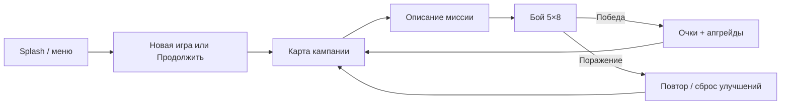
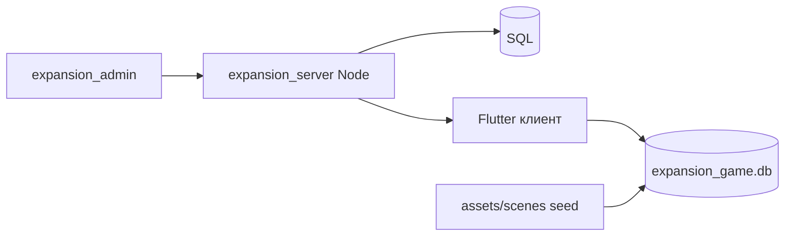

# Концепция игры Expansion (черновик)

> **Статус:** черновик для согласования. Источник — анализ legacy `expansion_old/expansion` + текущий план нового клиента.  
> После правок с твоей стороны — блок «Вопросы» закрываем, версия **1.0 (утверждено)** — и только тогда domain/SQLite/экраны.

Связанные документы: [`game-plan.md`](game-plan.md), [`project-specs.md`](project-specs.md).

---

## 1. В одном абзаце

**Expansion** — портретная космическая RTS в духе *Eufloria*: игрок захватывает базы на сетке, отправляет флоты по прямым линиям, развивает щиты и производство. Кампания — **линейная карта из ~101 миссий** (звёзды/системы) с сюжетными текстами; каждая миссия — отдельный бой на поле **5×8**. Между боями — **очки** и **апгрейды** (скорость, прочность, доход и т.д.). Сложность влияет на темп AI. В перспективе — аккаунт, синхронизация контента с сервером и админкой.

---

## 2. Жанр и ощущение

| Аспект | Решение (как в legacy, предлагаем сохранить) |
|--------|-----------------------------------------------|
| Камера | 2D, портрет, immersive UI |
| Темп | Real-time: тики ~50 FPS в isolate, UI получает события |
| Фантазия | Захват Солнечной системы, вторжение на Плутон, «экспансия vs экспансия» |
| Сессия | Короткий бой (минуты) + мета на карте кампании |
| Целевая платформа | iOS / Android (новый клиент); контент с сервера + локальный кэш |

---

## 3. Основной игровой цикл (classic — ядро продукта)

**Первый запуск (как задумано в legacy):**

1. Splash → вступительная история (у нас уже есть).
2. «Новая игра» → выбор **сложности** (и задумывалась **вселенная** — см. §6).
3. Первый бой может стартовать **сразу** (минуя карту), далее — через карту.
4. Победа → `mapClassic++`, начисление очков, экран улучшений.
5. «Продолжить» → карта (если уже был прогресс) или снова настройка новой игры.

**Что переносим осознанно, что пересматриваем:**

- Логику «захват всех вражеских баз = победа» — **да**.
- Баг legacy «поражение помечается победой» — **нет**, исправляем.
- Перепутанные RU/EN описания на карте — **нет**, исправляем.

---

## 4. Карта кампании

### 4.1 Контент миссии

Каждая миссия (`Scene`):

| Поле | Назначение |
|------|------------|
| `id` | Порядковый номер (1…101) |
| `nameRu` / `nameEn` | Название системы/узла |
| `descriptionRu` / `descriptionEn` | Текст на карте перед боем |
| `battleRu` / `battleEn` | Краткий брифинг перед боем (в legacy почти пусто — заполним или fallback) |
| `typeScene` | Визуальный тип узла на карте (траектории корабля: first…fifth в ряду) |
| Раскладка боя | Ссылка на layout: базы наш/враг/нейтралы |

В legacy JSON в assets — **camelCase**, модель ожидала **snake_case** → при переносе **единый контракт** (лучше snake в API и БД, конвертер при импорте старых файлов).

### 4.2 Визуал карты

- Сетка **5 колонок**, строки по числу миссий (~21 для 101).
- Узлы «змейкой» по рядам (переупорядочивание в `GameRepository.init` — логику сохранить, данные хранить уже **в БД**, не пересчитывать каждый раз на клиенте).
- Текущая миссия = прогресс игрока; пройденные — доступны для просмотра; будущие — «замок».
- Кнопка «Экспансия» / переход в бой — анимация полёта к узлу (можно упростить в MVP).

### 4.3 Раскладка боя миссии

- Файлы вида `objects_{n}.json`: `mainShipOur`, `mainShipEnemy`, массив `neutral` с координатами.
- В legacy только **40** файлов при **101** миссии — **дыра в контенте**; в новой версии либо дописать, либо уменьшить число миссий в релизе v1.

---

## 5. Бой (5×8)

### 5.1 Поле

- **5 строк × 8 столбцов** = 40 клеток.
- Сущности: **базы** (our / enemy / neutral), **корабли** (отряды), **астероиды** (случайные помехи).
- Движение отрядов — по **прямой** между базами, если нет препятствия на линии.

### 5.2 Действия игрока

1. Выбрать свою базу (откуда).
2. Выбрать цель (своя — подкрепление, чужая — атака, нейтрал — захват).
3. Отправить флот (обычно все корабли базы, если > 1).

На базе (автоматически по тикам): рост кораблей, ресурсы, улучшение щита/скорости постройки за ресурсы.

### 5.3 Бой отрядов и баз

- Столкновение отрядов → расчёт с учётом `shipDurability`.
- Атака базы → сначала щит, потом гарнизон; при нуле — **захват** (смена владельца, сброс части параметров).

### 5.4 Условия конца

| Исход | Условие |
|-------|---------|
| Победа | Нет баз `enemy` |
| Поражение | Нет баз `our` |
| Пауза | Модалки, брифинг, меню |

**Очки за победу:** от времени и «идеального» времени прохождения карты (`calculateScore` в legacy) — формулу можно упростить, но идея «быстрее = больше очков» сохраняется.

### 5.5 Техника

- **Game loop** в isolate (~50 FPS), в UI — `BattleCubit` / события (без GetX).
- AI врага: отдельный модуль (legacy `EnemyIntellect`) — апгрейд баз, выбор атаки/поддержки, интервал хода от сложности и апгрейда `tic`.

---

## 6. Режимы и сложность

### 6.1 Сложность (играем в MVP)

| Уровень | Смысл | Legacy-параметры |
|---------|--------|------------------|
| Easy | Медленный AI, слабый рост врага после боя | `ticEnemy` 600, `enemyPercent` 1, `enemySpeed` 0.3 |
| Average | По умолчанию | 400 / 2 / 0.5 |
| Difficult | Агрессивный AI | 200 / 3 / 0.7 |

Хранение: пока **prefs** (гость), позже — профиль на сервере.

### 6.2 «Вселенная» / тип кампании (legacy — частично мёртвый код)

В модели `Game.Univer`:

- `classic` — основная кампания (101 миссия).
- `generated` — задумывалась процедурная/вариативная.
- `strategic` — задумывался другой темп/правила.

В `UserGame` также есть **mapRandom / mapTower** и счета — **отдельные ветки не доведены** в UI.

**Предложение для v1 нового клиента:**

- Делаем только **Classic** end-to-end.
- `generated` / `strategic` / tower / random — **вне MVP**, но поля в схеме пользователя зарезервировать (или не добавлять до v2).

---

## 7. Мета: очки и апгрейды

### 7.1 Очки

- Валюта между боями: тратятся на повышение апгрейдов.
- После победы в classic начисляются в «наши» апгрейды; враг получает пакетное усиление (`toAllUpgrade`).

### 7.2 Апгрейды (our / enemy)

Типы (legacy `TypeUp`):

| Тип | Эффект |
|-----|--------|
| `shipSpeed` | Скорость кораблей |
| `shipDurability` | Прочность в бою |
| `shipBuildSpeed` | Скорость постройки |
| `resourceIncomeSpeed` | Доход ресурсов |
| `shieldDurability` | Прочность щита |
| `beginShips` | Стартовые корабли на базах |
| `tic` (только враг) | Частота ходов AI |

- Макс. уровень апгрейда: **5** (в UI иногда 6 слотов).
- Стоимость растёт (удвоение `nextScore` после покупки).
- Экран **«Улучшения»** на splash + legacy `/update` (сброс при поражении / обновление контента) — объединить в понятный UX позже.

**Поражение:** в legacy намёк на сброс апгрейдов через Update — **нужно твоё решение** (см. вопросы).

---

## 8. Пользователь и прогресс

### 8.1 Сейчас (новый клиент)

| Данные | Хранилище |
|--------|-----------|
| Splash, настройки UI | `SharedPreferences` |
| Каталог миссий, layout | SQLite (`expansion_game.db`), сид из файлов → потом sync API |
| Прогресс гостя | Prefs → позже согласуем поля |

### 8.2 Целевая модель игрока (после согласования концепции)

Минимальный набор для classic:

- `mapClassic` (текущая миссия, 1-based)
- `scoreClassic` (очки / валюта апгрейдов)
- `level` (easy / average / difficult)
- `isBegin` (нужен ли «церемониальный» заход на карту / первый бой)
- Апгрейды our/enemy (структура как `AllUpgrade`, без копирования багов именования)

Позже: регистрация, JWT, синк с сервером, топы.

### 8.3 Поток «Продолжить» (legacy)

- `mapClassic == 1` → экран новой игры.
- Иначе: если `isBegin` → **карта**, иначе → **сразу бой**.

Имеет смысл упростить: **всегда карта** как хаб, кроме самого первого сценария.

---

## 9. Экраны продукта (целевое)

| Экран | Маршрут (новый app) | Статус |
|-------|---------------------|--------|
| Splash + меню | `/` | ✅ |
| Настройки | `/settings` | ✅ минимум |
| История | `/intro-story` | ✅ |
| Карта | `/maps` | скелет |
| Новая игра | `/begin` | скелет |
| Бой | `/battle` | скелет |
| Профиль | `/profile` | скелет |
| Прогресс | `/progress` | скелет |
| Улучшения | `/upgrades` (предложить) | ❌ |
| Справка | `/help` | ❌ |
| Update / контент | sync + UI | ❌ |

---

## 10. Контент и инфраструктура

- **Источник правды для миссий:** сервер (админка), клиент — **кэш + версия**.
- Первичный сид на устройстве: **файлы** (`scenes.json`, `objects_*.json`) → импорт в SQLite (фаза 2).
- Схема SQLite проектируется так, чтобы **таблицы 1:1** легли на будущий SQL на Node.

---

## 11. Что из legacy не переносим

- GetX, freezed, `BlocProvider` на маршруты.
- `GameRepository.init()` с немедленным `return` и пустые заглушки API.
- Несохранение пользователя (`saveUser` закомментирован).
- `isEdit = true` в production.
- Секреты в репозитории apiserver.
- Путаница локалей и `LostEvent` → `isWin: true`.

---

## 12. MVP нового клиента (после утверждения концепции)

1. **Модели + SQLite** — сцены, layout, meta версии.
2. **Карта** — 101 узел, текущая миссия, переход в бой.
3. **Бой** — поле 5×8, отправка флота, победа/поражение, возврат на карту.
4. **Мета** — очки + экран апгрейдов (хотя бы our).
5. **Гость** в prefs; сервер — отдельная фаза.

---

## 13. Вопросы к тебе (нужны ответы перед финализацией)

1. **Число миссий в v1:** оставляем **101** или режем до **40** (пока есть только 40 `objects_*.json`)?
2. **Режимы:** подтверждаем **только Classic** в первом релизе? Нужны ли random/tower/strategic в roadmap с приоритетом?
3. **Первый бой:** сразу после «Новой игры» (как legacy) или **всегда через карту**?
4. **Поражение:** сбрасывать все апгрейды, только «наши», или дать повтор без сброса?
5. **Улучшения vs Update:** один экран `/upgrades` или два (мета-апгрейды и «обновить контент с сервера»)?
6. **Сюжет:** правим тексты из `scenes.json` / вступления или пишем заново? Нужен ли отдельный сценарист/локализация EN сразу?
7. **Онлайн:** гость-only до какого этапа; обязателен ли топ/регистрация в первом публичном релизе?
8. **Монетизация:** донат (legacy `/donate`) в scope или убираем?
9. **Баланс:** переносим формулы legacy как есть или закладываем окно для ребаланса после MVP?

---

## 14. История документа

| Версия | Дата | Комментарий |
|--------|------|-------------|
| 0.1 (черновик) | 2026-05-25 | Первичная выжимка из legacy + предложения по MVP |

После твоих правок: **0.2** с пометками «решено», затем **1.0 — утверждено**.
